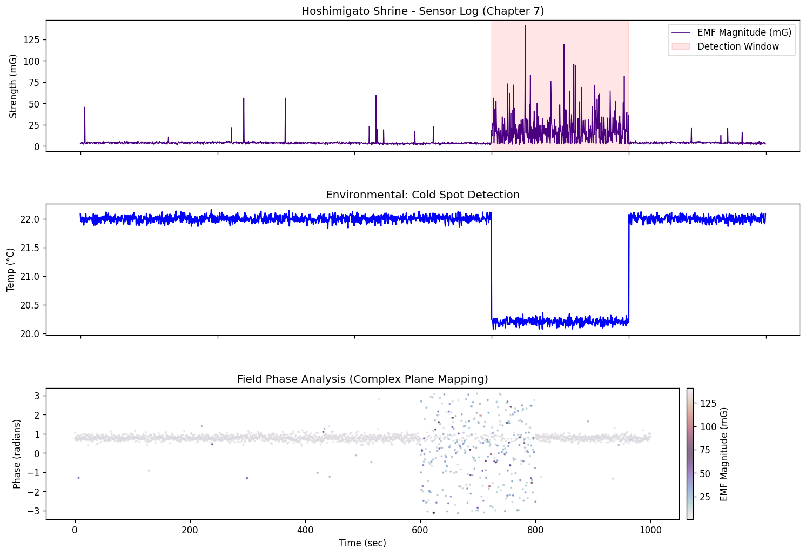

# Hoshimigato Shrine Sensor Log (Fictional) — Sample Data + Dashboard

📖 原作（note）：「第七章　夜の神社と探偵ごっこ」  
https://note.com/major_ruff2386/n/n478d06567843?magazine_key=m60ea3421f863


小説『『ほんまもんを選ぶ夏 ― 星見ケ里の光と影』の世界観（観測端末ログ／異常窓／コールドスポット／位相マッピング）を、
**数理っぽい見た目で説明するためのフィクション用デモ**です。

- データは実測ではなく、物語演出のために生成したサンプル（でっち上げ）です
- 「異常窓（event_flag=1）」の間だけスパイクと温度低下が出るように作っています


# Hoshimigato Shrine Sensor Log (Fictional) — Sample Data + Dashboard

[](
https://colab.research.google.com/github/Mokafe/reina-field-map/blob/main/hoshimigato-shrine-sim/notebooks/Hoshimigato_Shrine_Dashboard.ipynb
)




- 3軸の擬似EMF（X/Y/Z）から MAG = √(X²+Y²+Z²) を計算
- 事件窓（event_flag=1）でスパイク群発 + 温度低下（コールドスポット）
- X/Y を複素平面に見立て、位相 `phase = arctan2(Y, X)` を可視化

> 注意: これは物語説明用の合成データです。実測データではありません。

---

## 収録物

- `data/hoshimigato_shrine_sample.csv` / `data/hoshimigato_shrine_sample.json`  
  可視化デモ用サンプルログ（dt=0.5秒、2000サンプル、イベント窓=600〜800秒）
- `src/hoshimigato/`  
  読み込み (`io.py`) / 可視化 (`plotting.py`)
- `notebooks/Hoshimigato_Shrine_Dashboard.ipynb`  
  Colab向けノートブック（そのまま実行）

---

## すぐ動かす（ローカル）

> `scripts/plot_dashboard.py` は `src/` を自動で Python パスに追加するので、そのまま動きます。

```bash
python -m venv .venv
source .venv/bin/activate  # Windowsは .venv\Scripts\activate
pip install -r requirements.txt
python scripts/plot_dashboard.py --input data/hoshimigato_shrine_sample.csv
```

---

## Colabで動かす（GitHubに置いた後）

1. このリポジトリをGitHubにpush
2. Colabで次のURL形式を開く（自分のユーザー名/リポジトリ名に置換）

```text
https://colab.research.google.com/github/<YOUR_GITHUB>/<REPO_NAME>/blob/main/notebooks/Hoshimigato_Shrine_Dashboard.ipynb
```

ノートブック内で `pip install -r requirements.txt` を実行後、サンプルCSV/JSONを読み込んで描画します。

---

## データ形式

CSV/JSONともに列は同じです（JSONは `{"metadata":..., "records":[...]}` 形式）。

| column | meaning |
|---|---|
| t_sec | 時刻（秒） |
| X, Y, Z | 擬似EMF 3軸（mG） |
| MAG | √(X² + Y² + Z²)（mG） |
| temp | 温度（°C） |
| phase | `arctan2(Y, X)`（ラジアン） |
| event_flag | 事件窓フラグ（0/1） |
| terminal_id | 観測端末ID |
| location | ロケーション名 |

---

## ライセンス

MIT License（自由に改変・再配布OK）
